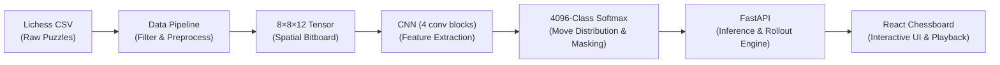

# Chess Mate Vision — Deep CNN for Tactical Checkmate Recognition

A deep learning and computer vision-inspired chess tactical system designed to recognize and execute forced checkmate patterns (such as Mate in 1 and Mate in 2) directly from spatial board representations. The project features an end-to-end pipeline: automated dataset extraction from millions of Lichess puzzles, PyTorch CNN training and ONNX export, high-performance FastAPI inference with legal-move masking and rollout simulation, and an interactive React web interface with animated board playback and telemetry.

---

## 1. Overview

**Chess Mate Vision** tackles tactical checkmate recognition by framing move prediction as a spatial pattern classification task over an $8 \times 8 \times 12$ bitboard representation:

- **Data Pipeline**: Downloads and filters over 4 million puzzles from the Lichess Open Database down to clean forced checkmate patterns (`mateIn1`, `mateIn2`).
- **Deep CNN Architecture (`ChessTacticsCNN`)**: A 4-stage convolutional network with spatial batch normalization and dense classification layers predicting across all $4,096$ possible origin-destination square pairs.
- **Inference & Rollout Service**: FastAPI backend supporting both single-position move prediction (with illegal move masking) and multi-step tactical rollout simulation that selects the most stubborn defensive counter-moves until checkmate is reached.
- **Interactive UI**: Modern React + Vite application featuring `react-chessboard`, dynamic SVG arrow overlays for attack trajectories, step-by-step playback controls, and real-time model telemetry (inference latency, top move confidence distribution).

---

## 2. Architecture



### End-to-End Pipeline Stages

1. **Ingestion & Filtering**: The raw Lichess puzzle archive is streamed in compressed chunks. Puzzles labeled with `mateIn1` and `mateIn2` are isolated and cleaned.
2. **Bitboard Tensorization**: Board states in FEN notation are parsed into rank-major spatial tensors of shape `(12, 8, 8)`, preserving board geometry and piece relationships.
3. **Feature Extraction**: Four convolutional blocks extract localized tactical motifs (forks, pins, open files, back-rank weaknesses, king exposure).
4. **Action Space Classification**: The dense head projects spatial features into a $4,096$-dimensional move vector. Moves illegal in the current position are masked with $-\infty$ before softmax normalization.
5. **FastAPI Serving**: Serves predictions with sub-20ms latency using ONNX Runtime (or PyTorch fallback) and performs iterative rollouts.
6. **React Chessboard**: Consumes API outputs to render animated pieces, directional attack vectors, and step-by-step mate sequences.

---

## 3. Project Structure

```
ML-miniproject/
├── ml/
│   ├── __init__.py
│   ├── dataset.py          # Data engineering, FEN→tensor, move encoding, PyTorch Dataset
│   ├── train.py            # CNN architecture, training loop, checkpointing, ONNX export
│   └── download_data.py    # Lichess puzzle download & filter script
├── backend/
│   ├── __init__.py
│   └── app.py              # FastAPI inference service (/health, /predict-move, /solve-mate)
├── frontend/
│   ├── package.json
│   ├── vite.config.js
│   ├── tailwind.config.js
│   ├── postcss.config.js
│   ├── index.html
│   └── src/
│       ├── main.jsx
│       ├── App.jsx          # Main app with chessboard, puzzle selector, solve controls
│       ├── index.css        # Tailwind directives + custom dark theme
│       └── components/
│           ├── ChessboardPanel.jsx   # Interactive board with arrows & animations
│           ├── PuzzleSelector.jsx    # Preset puzzles + custom FEN input
│           ├── SolveControls.jsx     # Play/Pause/Step/Reset playback controls
│           └── TelemetryPanel.jsx    # ML inference stats, confidence bars, SAN notation
├── weights/                 # Model checkpoint directory (.gitkeep)
├── data/                    # Puzzle CSV directory (.gitkeep)
├── .gitignore
├── requirements.txt
└── README.md
```

---

## 4. Quick Start

### Prerequisites

- **Python**: 3.10 or higher
- **Node.js**: 18.0 or higher (with `npm`)

### Setup & Run (One Command)

To run both the FastAPI backend and React frontend simultaneously in a single terminal:

```bash
./run.sh
```
*(Or alternatively: `python run.py` or `npm start`)*

This automated launcher will:
- Check your environment and Python virtualenv.
- Verify frontend dependencies (runs `npm install` if needed).
- Clear any lingering processes on ports 8000 & 5173.
- Launch the FastAPI server and Vite dev server simultaneously.
- Automatically launch your browser at [http://localhost:5173](http://localhost:5173).
- Gracefully shut down both servers when you press `Ctrl+C`.

---

### Manual Multi-Terminal Setup (Optional)

If you prefer to run the backend and frontend in separate terminals:

1. **Start the FastAPI Backend**:
   ```bash
   .venv/bin/python backend/app.py
   ```
2. **Start the React Frontend**:
   ```bash
   cd frontend && npm run dev
   ```

---

## 5. Model Architecture

The core model is **`ChessTacticsCNN`**, a custom deep convolutional neural network engineered for spatial chess pattern recognition:

```
Input: 8×8×12 Bitboard Tensor
  │
  ├── [Conv Block 1] Conv2d(12 → 64, kernel=3, padding=1) + BatchNorm2d + ReLU
  ├── [Conv Block 2] Conv2d(64 → 128, kernel=3, padding=1) + BatchNorm2d + ReLU
  ├── [Conv Block 3] Conv2d(128 → 128, kernel=3, padding=1) + BatchNorm2d + ReLU
  ├── [Conv Block 4] Conv2d(128 → 256, kernel=3, padding=1) + BatchNorm2d + ReLU
  │
  ├── Flatten (256 × 8 × 8 = 16,384 features)
  ├── Fully Connected Linear(16384 → 512) + ReLU
  ├── Dropout(p=0.3)
  └── Output Linear(512 → 4096)
        │
        └── Illegal Move Masking (-inf) ──► Softmax ──► Probability Distribution
```

### Representation Details

- **Input Tensor (`12 × 8 × 8`)**:
  - Channels `0`–`5`: White pieces `[Pawn, Knight, Bishop, Rook, Queen, King]`
  - Channels `6`–`11`: Black pieces `[pawn, knight, bishop, rook, queen, king]`
  - Spatial Grid: $8 \times 8$ board where rank 8 is row 0 and file A is column 0.
- **Output Action Space ($4,096$ Classes)**:
  - Discrete move indexing: $\text{class\_index} = (\text{from\_sq} \times 64) + \text{to\_sq}$ where $\text{square} \in [0, 63]$.
  - **Illegal Move Masking**: At inference time, logits corresponding to illegal moves in the current position are set to $-\infty$ prior to softmax evaluation, strictly guaranteeing that the predicted move conforms to chess rules.

---

## 6. API Reference

The backend exposes three REST endpoints:

### 1. `GET /health`
Checks server health, execution device, and model checkpoint availability.

- **Request**:
  ```http
  GET /health HTTP/1.1
  Host: localhost:8000
  ```
- **Response**:
  ```json
  {
    "status": "ok",
    "device": "cpu",
    "model_loaded": true,
    "model_format": "onnx"
  }
  ```

---

### 2. `POST /predict-move`
Evaluates a single position given by its FEN string and predicts top candidate moves with associated confidences and legal status.

- **Request**:
  ```http
  POST /predict-move HTTP/1.1
  Host: localhost:8000
  Content-Type: application/json

  {
    "fen": "r1bqkb1r/pppp1ppp/2n5/4p3/2B1n3/5Q2/PPPP1PPP/RNB1K1NR w KQkq - 0 5"
  }
  ```
- **Response**:
  ```json
  {
    "fen": "r1bqkb1r/pppp1ppp/2n5/4p3/2B1n3/5Q2/PPPP1PPP/RNB1K1NR w KQkq - 0 5",
    "top_moves": [
      {
        "uci": "f3f7",
        "san": "Qxf7#",
        "confidence": 0.9942,
        "is_legal": true,
        "is_check": true,
        "is_checkmate": true
      },
      {
        "uci": "c4f7",
        "san": "Bxf7+",
        "confidence": 0.0035,
        "is_legal": true,
        "is_check": true,
        "is_checkmate": false
      },
      {
        "uci": "f3e4",
        "san": "Qxe4",
        "confidence": 0.0018,
        "is_legal": true,
        "is_check": false,
        "is_checkmate": false
      }
    ],
    "latency_ms": 11.8
  }
  ```

---

### 3. `POST /solve-mate`
Performs an iterative multi-ply simulation: the CNN plays the attacking side while defensive replies are determined via opponent simulation, returning the full move-by-move sequence leading to checkmate.

- **Request**:
  ```http
  POST /solve-mate HTTP/1.1
  Host: localhost:8000
  Content-Type: application/json

  {
    "fen": "r1bqkb1r/pppp1ppp/2n5/4p3/2B1n3/5Q2/PPPP1PPP/RNB1K1NR w KQkq - 0 5",
    "max_depth": 6
  }
  ```
- **Response**:
  ```json
  {
    "success": true,
    "is_checkmate": true,
    "total_moves": 1,
    "sequence": [
      {
        "step": 1,
        "fen_before": "r1bqkb1r/pppp1ppp/2n5/4p3/2B1n3/5Q2/PPPP1PPP/RNB1K1NR w KQkq - 0 5",
        "fen_after": "r1bqkb1r/pppp1Qpp/2n5/4p3/2B1n3/8/PPPP1PPP/RNB1K1NR b KQkq - 0 5",
        "move": "f3f7",
        "san": "Qxf7#",
        "player": "white",
        "confidence": 0.9942,
        "is_check": true,
        "is_checkmate": true
      }
    ],
    "latency_ms": 18.2
  }
  ```

---

## 7. Demo Mode

The backend includes a built-in **Demo Mode**:
- If `weights/chess_mate_cnn.pt` or `weights/chess_mate_cnn.onnx` has not yet been generated via training, the service automatically initializes `ChessTacticsCNN` with random weights.
- Because illegal-move masking remains active even with random weights, the model will always return valid legal moves.
- This allows full front-end development, board interaction testing, and playback animation verification immediately without needing to complete the model training step first.

---

## 8. License

This project is open-source and licensed under the [MIT License](LICENSE).
